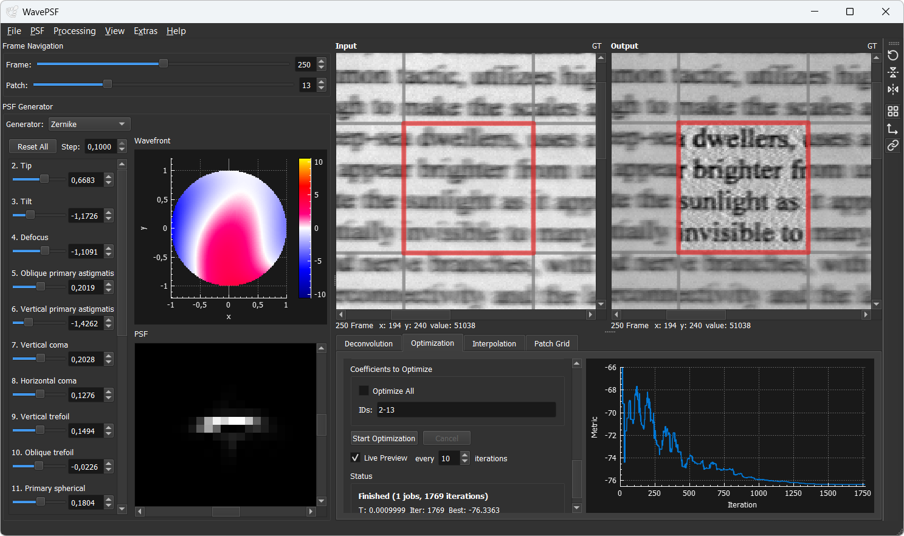
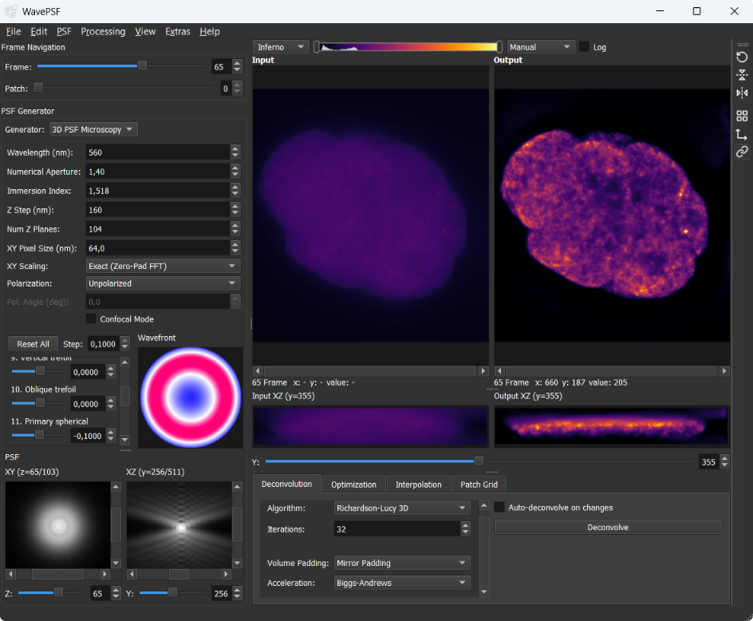

# WavePSF

WavePSF is a tool for estimating the spatially and spectrally varying point spread function (PSF) of an imaging system and using it directly for deconvolution. 
It was developed to be used with imaging spectrometers / hyperspectral imaging systems, but the basic idea should also work with other imaging systems.



## Method

WavePSF implements the method described in:

[Zabic, Miroslav, et al. "Point spread function estimation with computed wavefronts for deconvolution of hyperspectral imaging data." *Scientific Reports* 15.1 (2025): 673.](https://doi.org/10.1038/s41598-024-84790-6)

The core idea is to estimate PSFs by deconvolving the input image with varying PSFs and checking whether image quality improves.

PSFs are computed from wavefronts modeled with either Zernike polynomials or a deformable mirror simulation. Starting from an initial guess, the wavefront coefficients are iteratively adjusted by an optimization algorithm until an image quality metric improves. Currently the best metric is the normalized cross-correlation with a known ground truth image.

This means a calibration measurement of a known target is required (e.g. a printed page with text), along with a digital reference of that target (e.g. the same page as an image with matching area and orientation) to serve as ground truth.

Once the PSFs are estimated, they can be used to deconvolve actual measurements of unknown targets. The estimated PSFs remain valid as long as the imaging setup (focus, aperture, sample distance, ...) stays unchanged.

The estimated PSFs can also be used for optical characterization of your system. The size tells you the spatial resolution and the shape can indicate what optical aberrations are present.


## How to Use
- You can download pre-built Windows binaries from the [releases page](https://github.com/spectralcode/WavePSF/releases)
- Basic tutorial: [docs/user/tutorial.md](docs/user/tutorial.md)
- Example datasets: [data.uni-hannover.de](https://doi.org/10.25835/yu47lho4) -> download `data_tobacco_leaf.zip` for a purposely defocused dataset with ground truth, which produces particularly impressive deconvolution results


## Volumetric PSF and Deconvolution Support
In version 1.2.0, support for 3D PSF generation and deconvolution has been added. See [volumentric PSF and deconvolution tutorial](docs/user/tutorial_volumetric_deconvolution.md).



## Build

### Requirements

| Dependency | Notes |
|---|---|
| Qt5 | Tested with 5.12.12, should work with other versions too. But not with Qt 6.0+ |
| ArrayFire | Tested with 3.8.2, and 3.10. Should work with other versions too. |
| C++ compiler | C++11, MSVC is required due to ArrayFire |

### Windows
1. Install [MSVC Build Tools](https://learn.microsoft.com/en-us/visualstudio/releases/2022/release-history#fixed-version-bootstrappers) with the "Desktop development with C++" workload.
2. Install [ArrayFire v3](https://arrayfire.com/download/)
3. Install [Qt 5](https://download.qt.io/archive/qt/5.14/5.14.2/), open Qt Creator and configure MSVC kit.
4. Build from the command line using the Qt MSVC environment:

```bat
mkdir build
cd build
qmake ..\wavepsf.pro -spec win32-msvc CONFIG+=release
nmake
```
Or open `wavepsf.pro` in Qt Creator, select the MSVC kit, and build.

### Linux
Should work, not tested yet. 

## License
GPL-3.0 License. See [LICENSE](LICENSE) for details.