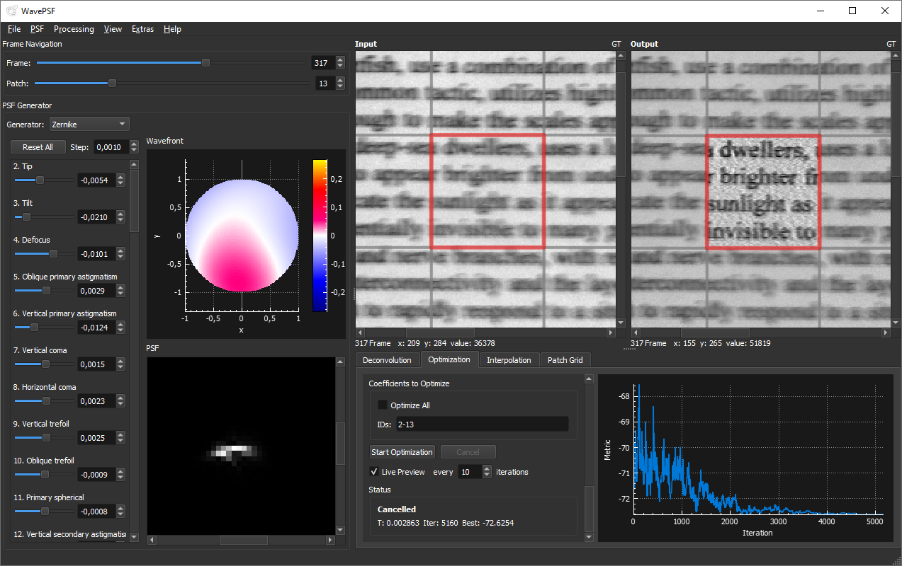

# WavePSF

WavePSF is a tool for estimating the spatially and spectrally varying point spread function (PSF) of an imaging system and using it directly for deconvolution. 
It was developed to be used with imaging spectrometers / hyperspectral imaging systems, but the basic idea should also work with other imaging systems.



## Method

WavePSF implements the method described in:

[Zabic, Miroslav, et al. "Point spread function estimation with computed wavefronts for deconvolution of hyperspectral imaging data." *Scientific Reports* 15.1 (2025): 673.](https://doi.org/10.1038/s41598-024-84790-6)

PSFs are generated from wavefronts calculated using Zernike polynomials or a deformable mirror simulation. Coefficients of the wavefronts are optimized patch-by-patch using simulated annealing (or other optimization algorithms) to minimize a image quality metric. 


## How to Use
- You can downlaod pre-built Windows binaries from the [releases page](https://github.com/spectralcode/WavePSF/releases)
- Basic tutorial: [docs/user/tutorial.md](docs/user/tutorial.md)
- Example datasets: [data.uni-hannover.de]( https://doi.org/10.25835/yu47lho4) -> download `data_tobacco_leaf.zip` for a purposely defocused dataset with ground truth, which produces particularly impressive deconvolution results


## Build

### Requirements

| Dependency | Notes |
|---|---|
| Qt5 | Tested with 5.12.12, should work with other versions too. But not with Qt 6.0+ |
| ArrayFire | Tested with 3.8.2, should work with other versions too. |
| C++ compiler | C++11, MSVC is required due to ArrayFire |

### Windows
1. Install [MSVC Build Tools](https://learn.microsoft.com/en-us/visualstudio/releases/2022/release-history#fixed-version-bootstrappers) with the "Desktop development with C++" workload.
2. Install [ArrayFire v3](https://arrayfire.com/download/)
3. Install [Qt 5](https://download.qt.io/archive/qt/5.14/5.14.2/), open Qt Creator and configure MSVC kit.
4. Build from the command line using the Qt MSVC environment:

```bat
mkdir build
cd build
qmake ..\wavepsf.pro -spec win32-msvc CONFIG+=release
nmake
```
Or open `wavepsf.pro` in Qt Creator, select the MSVC kit, and build.

### Linux
Should work, not tested yet. 

## License
GPL-3.0 License. See [LICENSE](LICENSE) for details.