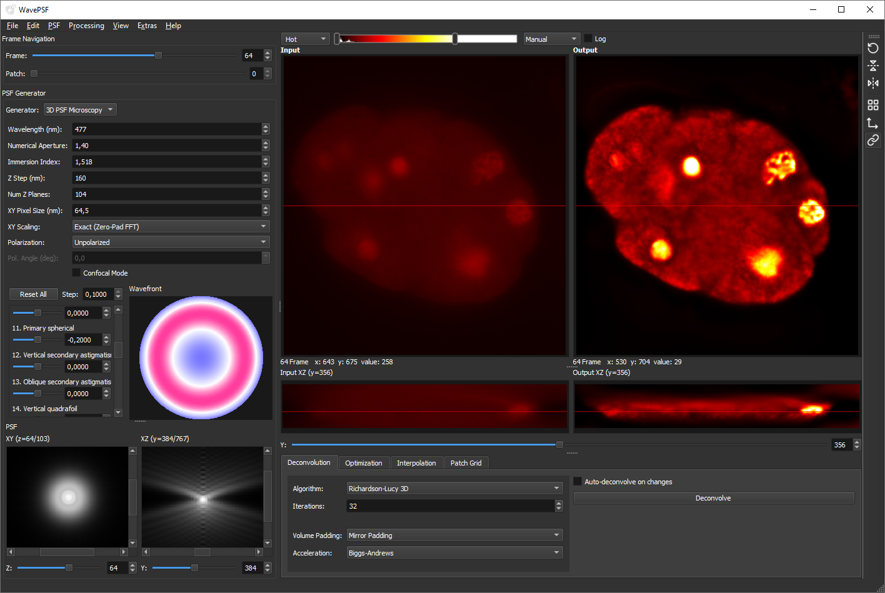

# Tutorial: Volumetric (3D) Deconvolution

This guide walks through 3D deconvolution of a microscopy z-stack using the C. elegans embryo dataset from EPFL. It covers generating a 3D PSF from physical parameters as well as loading a measured PSF from file.

---

## Dataset

Download one channel of the C. elegans embryo dataset from [https://bigwww.epfl.ch/deconvolution/bio/](https://bigwww.epfl.ch/deconvolution/bio/):

Extract both the data and PSF zip files. This tutorial uses the **DAPI channel** but any of the three works. 

---

## 1. Load the data

Drag and drop `CElegans-DAPI` folder onto the input viewer, or use **File > Open Image Folder**.

The image appears in the input viewer. Use the frame slider on the top left to scroll through z-slices.

## 2. Configure the GUI for volumetric work

**Adjust the viewer:**
- In the viewer toolbar (right of the output viewer), uncheck **Show Patch Grid** (we will later set the patch grid to 1 x 1; the grid overlay is not useful with a single patch)
- Ensure **Sync Views** is checked so input and output viewers share the same orientation and zoom
- Enable **View > Cross-Section Viewer** to see XZ cross-sections of input and output side by side, this is very useful for inspecting the axial resolution improvement after deconvolution

**Set the patch grid to 1 x 1:**
In the sidebar (below the input/output viewers), select the **Patch Grid** tab. Set both **Columns** and **Rows** to `1`. This way one single PSF is used for the entire volume. If you have image data with spatially varying blur, you would use a grid of patches and use a different PSF for each. For this tutorial, we keep it simple with a single patch.

**Disable auto-deconvolution:**
Switch to the **Deconvolution** tab. Uncheck **Auto-deconvolve on changes**. 3D deconvolution is computationally expensive and should be triggered manually.

**Select the 3D algorithm:**
In the **Algorithm** dropdown, select **Richardson-Lucy 3D**.

**Set iterations:**
Set **Iterations** to something between `10` and `32`.

---

## 3. Generate a 3D PSF from physical parameters

In the sidebar on the left, find the **Generator** dropdown and select **3D PSF Microscopy**.

A settings panel appears below the generator dropdown. Enter the acquisition parameters:

| Setting | Value |
|---------|-------|
| Wavelength (nm) | 477 |
| Numerical Aperture | 1.4 |
| Immersion Index | 1.518 |
| Z Step (nm) | 160 |
| Num Z Planes | 104 |
| XY Pixel Size (nm) | 64.5 |

Set **Num Z Planes** to match the number of z-slices in the data (104) in case it is not already auto-detected.

The PSF grid size can be adjusted in **Extras > Settings** under **Grid Size**. For the loaded dataset a grid size of 768 works well.

The 3D PSF preview at the bottom of the sidebar shows **XY Slice** and **XZ Section** views.

You can play around with the Zernike coefficients to add aberrations to the PSF. For this it is best to use the fast mode for **XY Scaling**. 

## 4. Run 3D deconvolution

Click the **Deconvolve** button. A progress dialog appears showing the current iteration. Now wait... 

When complete, the output viewer shows the deconvolved volume.

---

## 5. Load a PSF from file

Instead of generating a PSF from physical parameters, you can load a measured or precomputed PSF.

Extract the PSF zip file (e.g., `PSF-CElegans-DAPI.zip`). This produces a folder of TIFF files, one per z-slice.

In the sidebar, change the **Generator** dropdown to **From File**. Click **Open Folder...** and select the folder containing the extracted PSF TIFF files. The info panel below shows the detected PSF dimensions and file count.

## 6. Deconvolve with the loaded PSF

With the PSF loaded, click **Deconvolve** to run 3D Richardson-Lucy deconvolution using the measured PSF. 

---

## Tips
- To better compare input and output, set the same display range for both viewers. For this, right click on the display range slider and select **Fit to Output Frame**. Then you still can manually adjust the display range by moving the handles on the slider. 
- To better inspect the PSF you can right click on it and select **Log scale**

---

That's it! Have fun experimenting with 3D PSF generation and deconvolution!
